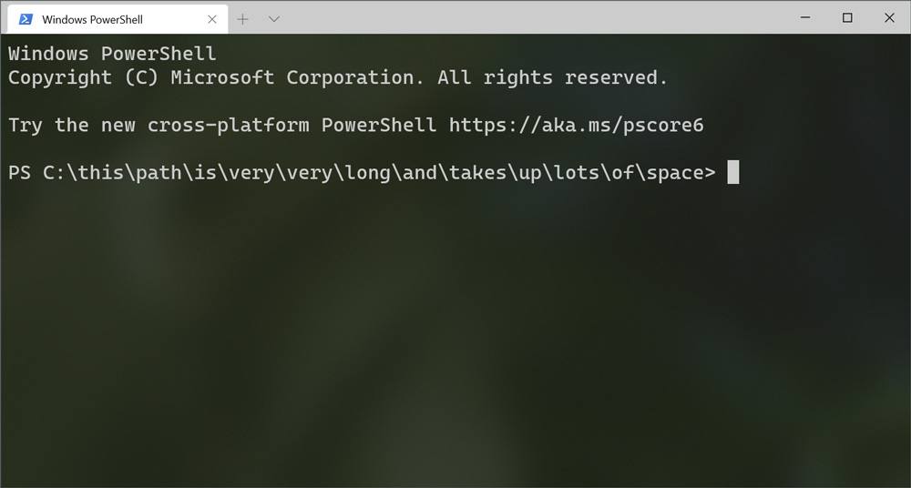
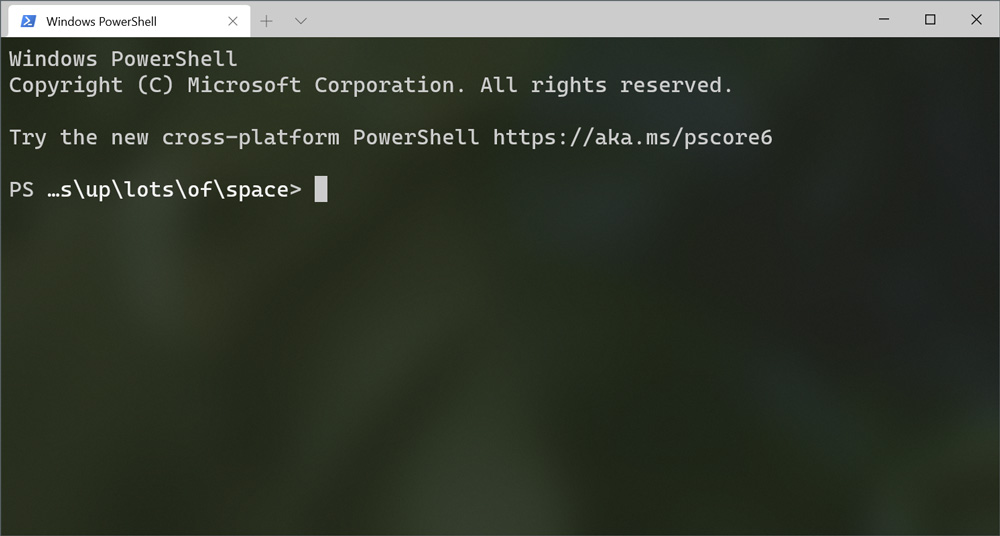

# PSShortPrompt
A simple PowerShell profile which ensures terminal screen real estate is never gobbled up by a long prompt.

## Why?
If you've ever been `cd`'d into a long path, you may have noticed that very little space is left for input before text must wrap around to the next line:

This PowerShell profile truncates/shortens/ellipsizes the working directory in your prompt to a maximum of 18 characters to ensure maximum space is left for input:

## Installation
Copy `Microsoft.PowerShell_profile.ps1` to `%USERPROFILE%\Documents\WindowsPowerShell`.